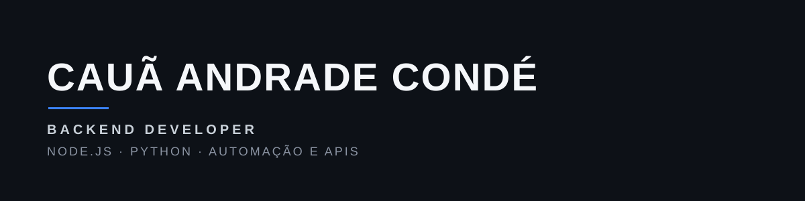
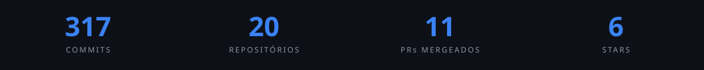
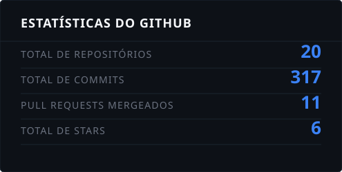
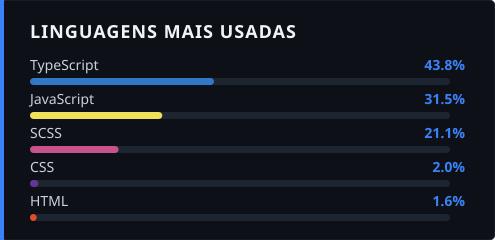

 

## Sobre mim

Desenvolvedor Back-End com experiência combinando rotina de produção real e projetos backend próprios.

No dia a dia profissional, trabalho com automação de captação de dados via web scraping (Python + Selenium), persistência em PostgreSQL, containerização com Docker, deploy em servidores Windows internos e suporte técnico remoto. Isso significa lidar com sistemas que já rodam em produção, não só em ambiente de estudo.

Em paralelo, construo APIs backend em Node.js/Express, com foco em validação robusta, autenticação segura (JWT/bcrypt) e controle de concorrência. Meu projeto [backend-barbershop](https://github.com/cauandrade123/backend-barbershop) é um exemplo disso, com locks de banco pra evitar corrida em agendamentos concorrentes.

Gosto de sistemas que não quebram sob uso real: validação de entrada, tratamento de erro consistente e cuidado com dados sensíveis.

## Experiência atual

**Backend & Automação**, empresa focada em captação de anúncios e dados

- Automação de coleta de dados com Python + Selenium (web scraping em produção)
- Persistência e modelagem de dados em PostgreSQL
- Containerização de serviços com Docker
- Deploy e manutenção em servidores Windows internos
- Suporte técnico remoto e reparo de máquinas (TeamViewer)

## Stack técnica

 

  

  
  
  
  

**Cloud:** AWS (foco atual de estudo) e Microsoft Azure (certificação AI-900)
**Estudando atualmente:** TypeScript, React

### Princípios de engenharia

Validação de entrada · Tratamento de erro consistente · Segurança em autenticação · Controle de concorrência · Separação de responsabilidades

## Certificações

- Microsoft Certified: Azure AI Fundamentals (AI-900)

## Projetos em destaque

| Projeto | Descrição | Stack |
|---|---|---|
| [**backend-barbershop**](https://github.com/cauandrade123/backend-barbershop) | API de agendamento com autenticação JWT, validação centralizada e locks de concorrência (`GET_LOCK`) para evitar conflitos de horário | Node.js, Express, MySQL |
| [**doctors-health-api**](https://github.com/cauandrade123/doctors-health-api) | Sistema de gerenciamento de pacientes com foco em segurança e performance | Node.js |
| **backend_ecommerce** *(privado, em desenvolvimento)* | Backend de e-commerce | Node.js, TypeScript |
| [**caua-andrade-portfolio**](https://github.com/cauandrade123/caua-andrade-portfolio) | Portfólio pessoal front-end | React, TypeScript |

## Estatísticas do GitHub

 

&nbsp;

 

## About me (English)

Backend developer combining hands-on production experience in data automation, PostgreSQL, Docker and Windows server deployments with self-built APIs in Node.js and Express, focused on validation, secure authentication and concurrency handling. Comfortable reading technical documentation and communicating in English in a professional context.

## Contato

 

&nbsp;

&nbsp;

  

Sistemas que funcionam de verdade, em produção, não só na demo.

